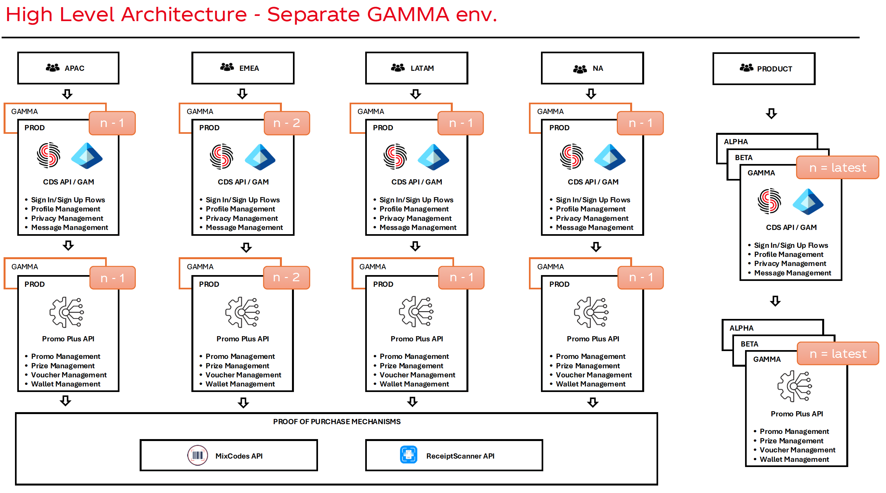

# [Future State] GCP Instances Strategy

Post GCP migration Promo+ instance strategy has to align with the C4P one as depicted below:

The evolution of the activation & support models for global charters/promotions based on the Regional Ops teams services allows splitting to regional instances and deprecating the Global instance post-migration.
OneXP as the single client of the Global instance will integrate to all four of the regional instances and run the promotions against the regional instance for the respective markets (sites).

## Proposed Split

| Experience                                    | Currently Hosted   | Future State         |
|-----------------------------------------------|--------------------|----------------------|
| OneXP Promotions APAC, NAOU, LATAM, ЕМЕ       | Global instance    | Regional instances   |
| OneXP Promotions EU                           | EMEA instance      | EMEA instance        |
| CCA & Daha Daha                               | EMEA instance      | EMEA instance        |
| Italy Promotions                              | Italy instance     | Italy instance       |
| NAOU Promotions                               | Global instance    | NAOU instance        |
| LATAM Regional Experience Promotions          | LATAM instance     | LATAM instance       |
| APAC Regional Experience Promotions           | APAC instance      | APAC instance        |
| Global Chatbot                                | Global instance    | Regional instances   |

## Risks and Mitigation

| Risk Area              | Risk Description                                                                 | Mitigation / Control                                                                                          | Owner                              |
|------------------------|---------------------------------------------------------------------------------|---------------------------------------------------------------------------------------------------------------|------------------------------------|
| **OneXP Integration**      | Dependency on the OneXP team to complete the reconfiguration for all remaining markets | Communicate, track and validate end‑to‑end per region before Global sunset                                    | OneXP Team (Prabhu)                |
| **Regional Readiness**    | Regions may not be fully prepared to operate Promo+ in Production independently   | Define and enforce readiness gates (Ops sign‑off, monitoring, on‑call, deployment validation) before redirecting traffic | Operations (Daniel)                |
| **Operational Ownership**  | Unclear incident ownership once Global Promo+ instance is no longer live          | Publish updated RACI including the new scope for Regional Ops, Global Ops, and Promo+                         | MarTech Leadership (Tanya)         |
| **Hidden Dependencies**    | Legacy services or experiences may still reference Global Promo+ endpoints; Old integration dependencies (ex wallet, points) | Perform dependency audit and freeze new Global usage; monitor for unexpected Global calls; migrate old wallets | Promo+ (Vessela) / Operations (Daniel) |
| **Active Campaigns**       | Campaigns may still be running on Global at the time of sunset                    | Execute phased sunset: freeze new launches → expire active campaigns → redirect traffic → decommission        | Promo+ / Operations (Vessela / Daniel) |
| **Escalation Surge**       | Increase in incidents and escalations during the transition period                | Introduce a temporary hypercare phase with clear escalation thresholds and response SLAs                      | Operations (Daniel)                |
| **Market Confusion**       | Markets may be unclear where to launch or operate promotions post‑sunset          | Issue clear market communication outlining “What changes / What stays the same”                               | Promo+ (Vessela)                   |
| **Analytics**              | Flows being sent to CX teams; multiple sources                                   | Define what data is where; update the mapping; patterns of consumption                                        | Promo+ (Vessela)                   |

## Sunset Readiness Gate
Global Promo+ can be fully sunset **only when all of the following are true**:

- OneXP routes 100% of promotion traffic to regional instances
- No active campaigns are running on Global
- Ops team confirm Production readiness (on‑call, monitoring, deployments)
- No critical dependencies on Global Production remain

## Next Steps to Align On (23-Feb)

* [ ] Formalise the role of the Global Promo+ instance - repurposing to NAOU instance or sunsetting entirely while creating a new NAOU instance
* [ ] Confirm Regional instance ownership & accountability
* [ ] Define the sunset milestone

## Operational Follow-ups:

* [ ] Create a RACI on a high-level & Regional owners - Tanya & Vessela & Daniel
* [ ] Explicit ownership assignment for OneXP changes - Prabhu
* [ ] Update support and escalation model - Daniel
* [ ] Create a phased sunset timeline - Vessela
